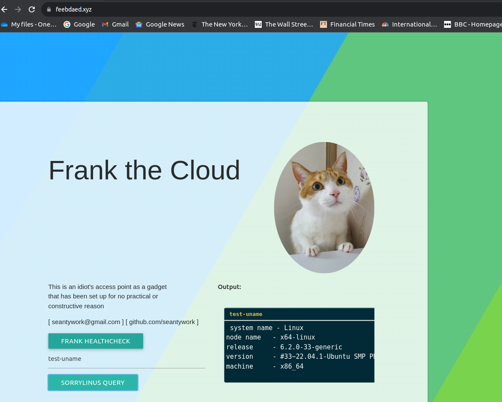

# sorrylinus

===========


I'm sorry Linus, for building the most useless software on earth to handle remotely

the most useful software on earth

**Disclaimer : I am not liable for any misuse of this code**
**Only use it on machines and in environments that you have explicit permissions and authrizations to do so**

# sorrylinus hub mode
## Public access point for controlling sorrylinus socket client

[feebdaed.xyz](https://feebdaed.xyz)

Now every component is written in C, including TCP/TLS sockets, \
HTTP and WebSocket servers

run option for public access is: 

```shell
    cd src && solic
```

below is the resulting output of 'test-uname' flag 

tested on arm64



below is the raspberry pi 4 side ir transreceiver setting


successful test has been recorded and published

[ir-success](https://youtube.com/shorts/hcPera-hTdc?feature=share)


